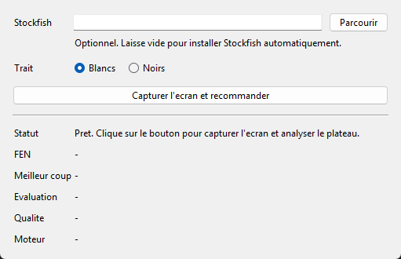
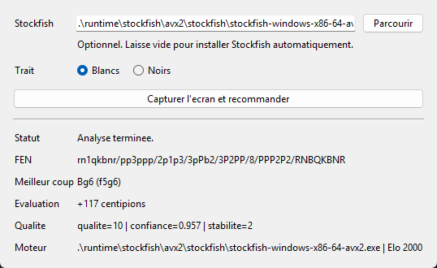
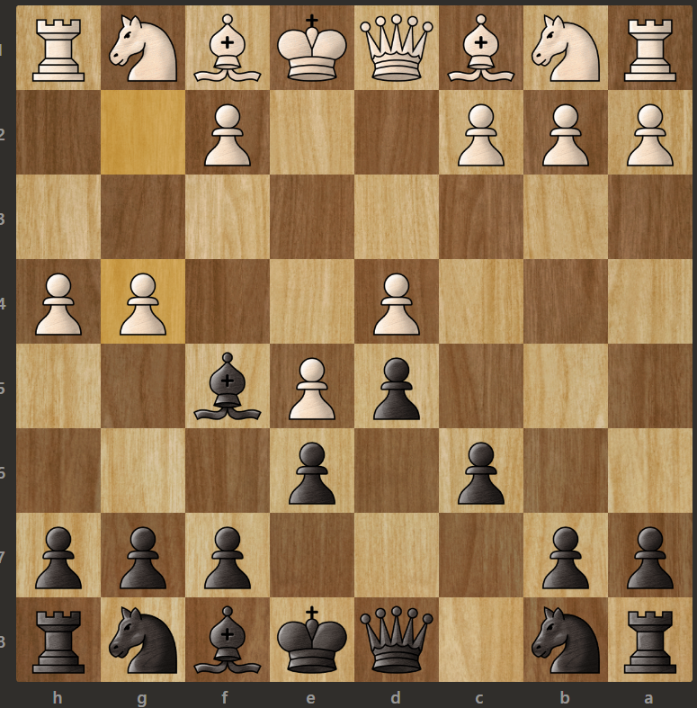

# Chess Screen Assistant

Application Windows pour capturer ton ecran, detecter automatiquement un plateau d'echecs visible dans la capture, extraire le FEN et demander un meilleur coup a Stockfish limite a 2000 Elo.

## Apercu

### Interface



### Exemple de resultat



### Exemple de plateau detecte



## Ce que fait le projet

- capture tout l'ecran
- detecte le plateau dans une image plein ecran
- extrait le FEN avec un pipeline de vision + classification
- demande un coup a Stockfish
- installe Stockfish automatiquement si le moteur n'est pas deja present
- garde un mode script pour traiter un dossier d'images

## Prerequis

- Windows
- Python 3.10 ou plus recent
- un environnement virtuel Python
- connexion reseau au premier calcul moteur si Stockfish n'est pas deja present

## Installation

```powershell
python -m venv venv
.\venv\Scripts\activate
pip install -r requirements.txt
```

## Lancement rapide

### Application desktop avec bouton

```powershell
.\launch_chess_assistant.bat
```

ou :

```powershell
.\venv\Scripts\python.exe .\chess_assistant.py
```

## Utilisation

1. Affiche le plateau sur ton ecran.
2. Lance l'application.
3. Laisse le champ `Stockfish` vide pour l'installation automatique, ou renseigne un moteur existant si tu veux forcer un binaire precis.
4. Choisis le camp au trait : `Blancs` ou `Noirs`.
5. Clique sur `Capturer l'ecran et recommander`.

Le flux complet est :

1. capture plein ecran
2. detection du plateau
3. extraction du FEN
4. evaluation moteur
5. affichage du meilleur coup

Si aucun moteur n'est trouve, l'application telecharge automatiquement une version Windows officielle de Stockfish au premier calcul.

## Configurer Stockfish

Trois options :

- ne rien faire : l'application installe automatiquement Stockfish au premier calcul
- renseigner le chemin dans le champ de l'application
- definir la variable d'environnement `STOCKFISH_PATH`

Exemple PowerShell :

```powershell
$env:STOCKFISH_PATH="C:\chemin\vers\stockfish.exe"
```

Le moteur est configure a `2000` Elo par defaut.

## Mode script

Le point d'entree historique existe toujours :

```powershell
.\venv\Scripts\python.exe .\convert_fen.py
```

Ce mode parcourt les images du dossier courant et ecrit les resultats dans `fen_results.csv`.

## Sorties utiles

- `fen_results.csv` : resultats du traitement par lot
- `fen_overrides.csv` : corrections manuelles de FEN
- `runtime/stockfish` : moteur telecharge automatiquement en local

## Structure du projet

- `convert_fen.py` : facade de compatibilite
- `chess_assistant.py` : lancement de l'interface desktop
- `chess_fen/capture.py` : capture plein ecran
- `chess_fen/ui.py` : interface Tkinter
- `chess_fen/vision.py` : detection et crop du plateau
- `chess_fen/predictor.py` : evaluation des candidats et choix du FEN
- `chess_fen/fen_utils.py` : rotations, votes et utilitaires FEN
- `chess_fen/occupancy.py` : heuristiques visuelles d'occupation
- `chess_fen/engine.py` : integration Stockfish
- `chess_fen/service.py` : orchestration du pipeline

## Depannage

### L'application s'ouvre mais aucun coup n'est recommande

Cause probable :

- le telechargement automatique du moteur a echoue
- le chemin fourni pointe vers un mauvais fichier
- le moteur telecharge n'est pas compatible avec la machine

Solution :

- laisse le champ vide pour forcer l'installation automatique
- selectionne `stockfish.exe` via `Parcourir` si tu veux utiliser ton propre moteur
- ou configure `STOCKFISH_PATH`

### Le FEN est vide ou faux

Cause probable :

- le plateau n'est pas entierement visible
- une fenetre recouvre une partie du plateau
- la capture contient trop d'elements perturbateurs autour du plateau
- le camp au trait n'est pas le bon

Solution :

- garde le plateau bien visible
- evite les overlays et les notifications
- relance l'analyse avec un ecran plus propre
- corrige manuellement via `fen_overrides.csv` si besoin

### La capture d'ecran echoue

Cause probable :

- session Windows inactive
- bureau verrouille
- environnement distant ou capture bloquee

Solution :

- deverrouille la session
- relance l'application en local
- verifie qu'une capture d'ecran classique fonctionne sur la machine

### Le premier lancement est lent

Cause probable :

- telechargement du modele `chessimg2pos`
- telechargement automatique de Stockfish

Solution :

- attends le premier chargement
- les lancements suivants seront plus rapides

### Le script Python ne se lance pas

Verification minimale :

```powershell
.\venv\Scripts\python.exe -m py_compile convert_fen.py chess_assistant.py
```

Si ca echoue :

- verifie que l'environnement virtuel est bien installe
- reinstalle les dependances avec `pip install -r requirements.txt`

## Notes

- Le pipeline accepte les captures plein ecran, pas seulement des screenshots deja recadres.
- Le FEN reste deterministe sur les captures de test actuelles.
- Le moteur est auto-installe au premier usage si besoin, puis reutilise localement.
